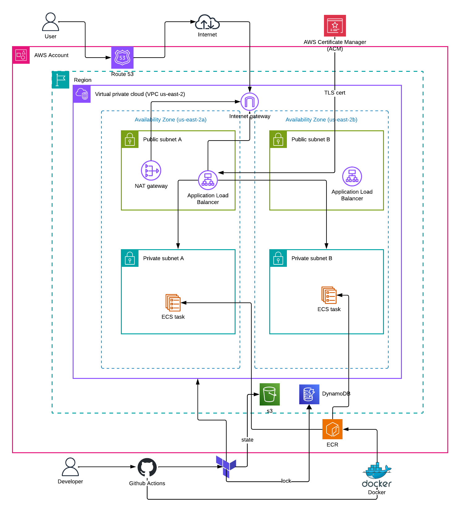
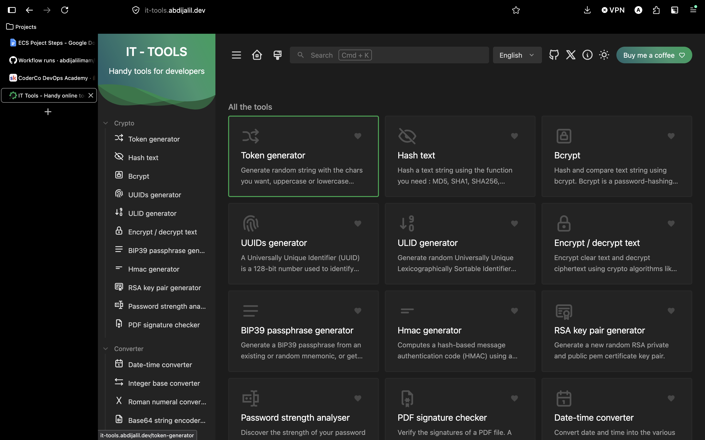
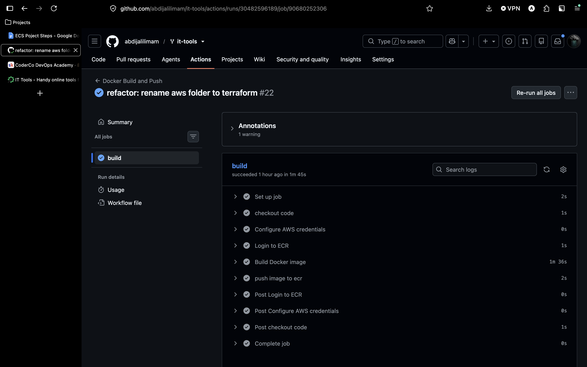
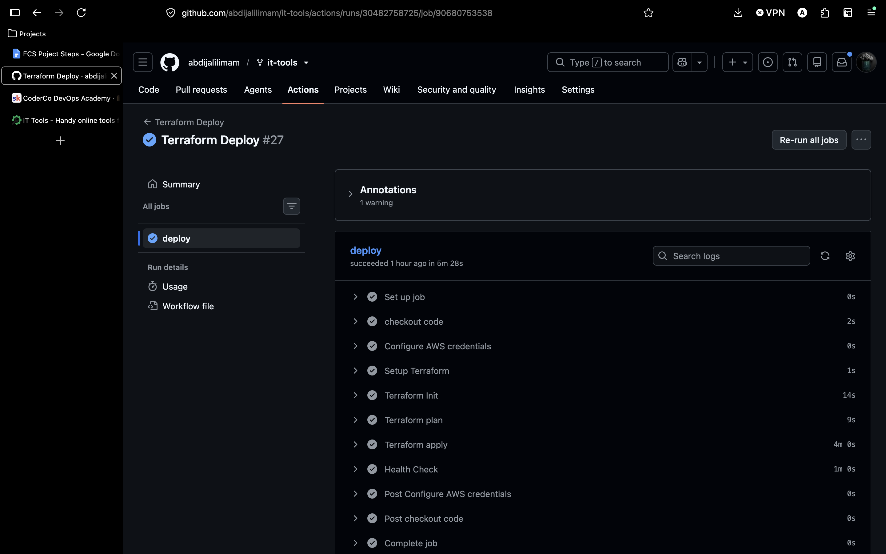
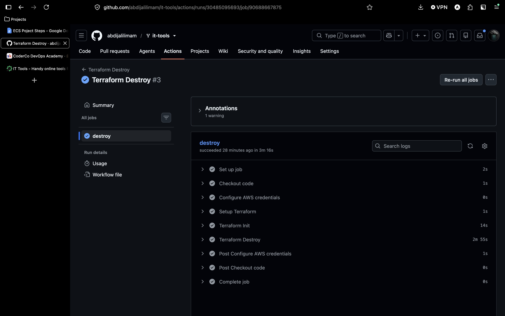
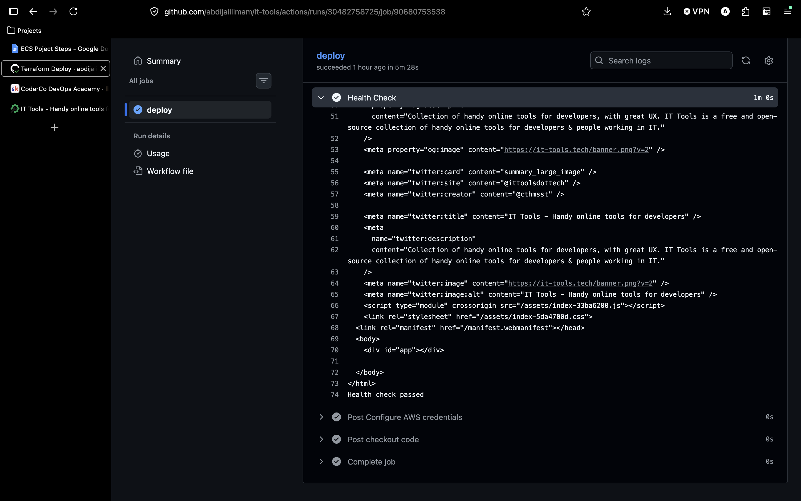

# IT Tools — Production Deployment on AWS

A production deployment of [it-tools](https://github.com/CorentinTh/it-tools) a handy collection of developer utilities. containerised with Docker and deployed to AWS ECS Fargate using Terraform, with a fully automated CI/CD pipeline via GitHub Actions.

**Live at: https://it-tools.abdijalil.dev**

---
## Overview

it-tools is an open-source collection of utility tools built for developers. It's built with Vue and TypeScript, compiles down to static files, and is served by nginx with no backend or database. I picked it because it's the kind of app that looks simple on the surface but actually needed real infrastructure to run properly — a multi-stage Docker build, a proper web server, HTTPS, and a deployment pipeline. That gap between how simple the app is and how much work the infrastructure requires is exactly what made it a good target for me.

ECS Fargate made more sense than Vercel because it locks you into their ecosystem, providing no ability to troubleshoot when a deployment fails. A VM was not even considered because you end up spending more time patching and managing the OS than actually building infrastructure. Fargate sits in the right spot — AWS handles the compute, and you still have full control over the networking, security, and scaling. It integrates natively with ECR, ALB, and IAM, supports multi-AZ deployments, and scales horizontally just by increasing the desired task count. The whole thing started with manually clicking through the AWS Console to understand each service, then got rebuilt in Terraform and automated with GitHub Actions.

---

## Architecture



## Tech Stack

| Category | Tool |
|----------|------|
| App | it-tools (Vue / TypeScript) |
| Container | Docker, nginx:stable-alpine (multi-stage build) |
| Registry | AWS ECR |
| Infrastructure | Terraform (modular) |
| Compute | AWS ECS Fargate |
| Networking | VPC, ALB, NAT Gateway, 2 AZs |
| DNS | Route 53 + Namecheap |
| HTTPS | AWS ACM (wildcard cert) |
| CI/CD | GitHub Actions + OIDC |
| State | Terraform remote state in S3 |

---

## Repo Structure

```
it-tools/
├── Dockerfile                   # Multi-stage Docker build
├── terraform/                   # Terraform modules
│   ├── main.tf                  # Root module + OIDC/IAM
│   ├── variables.tf / outputs.tf / provider.tf
│   └── modules/
│       ├── vpc/                 # VPC, subnets, IGW, NAT Gateway
│       ├── alb/                 # ALB, listeners, target group, SG
│       ├── ecs/                 # Cluster, service, task def, IAM
│       ├── ecr/                 # Container registry
│       └── acm/                 # SSL certificate + validation
├── .github/workflows/
│   ├──docker-build.yml          # Build + push to ECR
│   ├──terraform-deploy.yml      # Terraform apply + health check
│   └──terraform-destroy.yml     # Manual destroy pipeline
├── architecture-it-tools.png    # Architecture diagram
└── screenshots/                 # Screenshots
```

---

## Local Setup

### Prerequisites

- Node.js
- pnpm
- Docker

### Run the application

Install dependencies and start the development server:

```bash
pnpm install
pnpm dev
```

The application will be available at:

```
http://localhost:5173
```

### Run with Docker

Build the production image:

```bash
docker build --platform linux/amd64 -t it-tools:local .
```

Run the container:

```bash
docker run -p 80:80 it-tools:local
```

Then open:

```
http://localhost
```

## Issues I ran into 

**ARM vs AMD64** — images built on Apple Silicon are incompatible with ECS Fargate by default. Fixed with `--platform linux/amd64`.

**Terraform state in CI/CD** — GitHub Actions runners start fresh with no local state. Moving state to S3 solved this.

**OIDC setup** — trust policy conditions have to be exactly right (`repo:abdijalilimam/it-tools:*`). Small mistakes here cause  auth failures.

**DNS automation** — Initially used Cloudflare for DNS which required manually updating the CNAME record after every deploy since Cloudflare Registrar doesn't allow external nameservers. I solved by purchasing `abdijalil.dev` through Namecheap, pointing nameservers to Route 53, and adding an `aws_route53_record` resource to Terraform so DNS updates automatically after every `terraform apply`.

**Resource conflicts** — repeated terraform destroy/apply cycles caused "resource already exists" errors. Fixed with `terraform import`.

---

## App Demo



---

## Pipeline Screenshots

**Docker Build and Push**



---

**Terraform Deploy**



---

**Terraform Destroy**



---

**Health Check**

